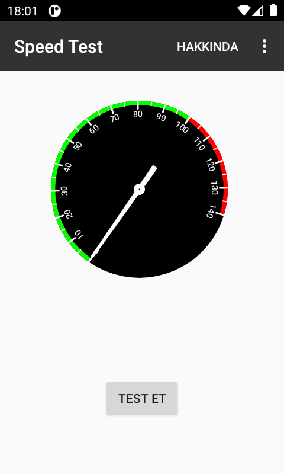

# Android-Speed-Test

     

---

# Bu Projenin Yapımı

Önce projemize hangi kütüphaneyi ekleyeceğimizi seçelim. Ben bu örnekte GitHub üzerinde bulunan (https://github.com/bertrandmartel/speed-test-lib) ve MIT lisansı olan bir hız testi kütüphanesini kullanacağım. MIT lisansı olduğundan dolayı yazılımdaki kodları ücretsiz olarak kullanabilir, değiştirebilir ve bu yazılımı ekleyerek yaptığımız yeni yazılımı kapalı kod olarak çoğaltıp kullanabilir yada satabiliriz.

Her yeni kütüphaneyi eklerken yaptığımız gibi öncelikle build.gradle (Module: app) dosyasına kütüphanenin adını ekleyip senkron edelim. Ekleyeceğimiz kodu kütüphaneyi oluşturan kişi, kütüphanenin yüklü olduğu GitHub reposunun içindeki README.md dosyasında belirtmiş. Bu dosyanın içine girmemize gerek yok. GitHub bu dosyayı otomatik olarak görselleştirip reponun altında zaten gösterir.


compile‘nın üzeri çizildi çünkü Android Studio artık implementation‘a geçtiği için compile’nı silip yerine implementation yazalım.

Sonra sağ üstte bulunan “Sync Now” yazısına tıklayarak kütüphaneyi projemize senkron edelim.


BUILD SUCCESSFUL yazısını alırsak kütüphane başarıyla içeriye eklenmiş demektir.

Artık kütüphanemiz projemize eklendi şimdi kullanmaya başlayalım. MainActivity.java‘ya geri dönüp kodlarımızı yazmaya başlayalım. Projeye ait kodları yazarken otomatik olarak tamamlama seçenekleri alta açılacaktır.

Kütüphaneyi hangi kodlarla nasıl kullanacağımızı bilmiyorsak README.md dosyasına tekrar bakalım. Kütüphane yazarı nasıl kullanacağımız hakkında bildi vermiş olabilir.


Gördüğünüz gibi Usage başlığı altında hangi şekilde nasıl kullanacağımızı kodlar ile açıklamış.

Sayfanın alt kısımlarına baktığımızda doğrudan log penceresine yazdırmanın nasıl yapılacağını gösteren kodlar da var.


Gördüğünüz gibi bu kodda döndürülen değerleri Log.v kullanılarak Log penceresinde görmemizi sağlayacak.

Test için alıp deneyelim. Kod ana sınıfta değil de AsyncTask sınıfında kullanılmış. AsyncTask uygulamadan bağımsız arkaplanda işlem yaptırmak için kullanılır. Yani bu sınıfın içine yazacağımız işlemler çalışırken uygulama durup işlemin bitmesini beklemez ana sınıfa yazılan kodlar ile çalışmaya devam eder.

Yukarıdaki kodu yazalım ve kırmızı olan yerlere tıklatıp alt+enter yaparak kütüphanelerini ekleyelim. Ardından böyle bir sınıf olduğunu bildirip çalıştırtmak için de ana sınıfa da şu kodları yazalım;

```java
SpeedTestTask speedTestTask = new SpeedTestTask();
speedTestTask.execute();
Genel olarak MainActivity.java dosyamız tamamen şu şekilde oldu;

package com.PAKETİNİZİN ADINI YAZIN.speedtest;

import androidx.appcompat.app.AppCompatActivity;

import android.os.AsyncTask;
import android.os.Bundle;
import android.util.Log;

import fr.bmartel.speedtest.SpeedTestReport;
import fr.bmartel.speedtest.SpeedTestSocket;
import fr.bmartel.speedtest.inter.ISpeedTestListener;
import fr.bmartel.speedtest.model.SpeedTestError;

public class MainActivity extends AppCompatActivity {

    @Override
    protected void onCreate(Bundle savedInstanceState) {
        super.onCreate(savedInstanceState);
        setContentView(R.layout.activity_main);

        SpeedTestTask speedTestTask = new SpeedTestTask();
        speedTestTask.execute();

    }


    class SpeedTestTask extends AsyncTask<Void,Void,Void>
    {

        @Override
        protected Void doInBackground(Void... voids) {

            SpeedTestSocket speedTestSocket = new SpeedTestSocket();

            speedTestSocket.addSpeedTestListener(new ISpeedTestListener() {

                @Override
                public void onCompletion(SpeedTestReport report) {

                    Log.v("speedtest", "[COMPLETED] rate in octet/s : " + report.getTransferRateOctet());
                    Log.v("speedtest", "[COMPLETED] rate in bit/s   : " + report.getTransferRateBit());

                }

                @Override
                public void onProgress(float percent, SpeedTestReport report) {

                    Log.v("speedtest", "[PROGRESS] progress : " + percent + "%");
                    Log.v("speedtest", "[PROGRESS] rate in octet/s : " + report.getTransferRateOctet());
                    Log.v("speedtest", "[PROGRESS] rate in bit/s   : " + report.getTransferRateBit());

                }

                @Override
                public void onError(SpeedTestError speedTestError, String errorMessage) {

                }

            });

            speedTestSocket.startDownload("http://ipv4.ikoula.testdebit.info/1M.iso");

            return null;
        }
    }

}
```

Ancak şimdi direk çalıştırırsak hiçbir sonuç alamayız çünkü bu uygulamamız interneti kullanarak hızımızı ölçeceğinden uygulamaya internete erişim izni vermeliyiz.

Bunun için Android Studio’da dosyalarımızın gözüktüğü sol üst kısımdan manifests klasörünün altında ki AndroidManifest.xml dosyasına çift tıklayarak açalım. Ardından package ve application kodları arasına aşağıdaki internet izni isteme kodunu yazalım;

<uses-permission android:name="android.permission.INTERNET"></uses-permission>
Artık uygulamamızı normal şekilde çalıştıralım. Şuan için ekrana gelen emulator cihaza bakmayacağız bu yüzden bu sanal cihazı arkaya alalım ve Android Studio’da aşağıdan Logcat‘i seçelim. Log.v kodlarında log’a gelecek değerler speedtest tag‘ında olacağı için arama yerine speedtest yazalım.


Değerler yani internet hızımız bit olarak logcat ekranına geldi. İşlem oranını da yüzdeler halinde belirtiliyor.

Sırada bu verileri Android uygulamamızda bir grafik ile gösterelim.

Ben bu örnekte bu tasarımı kullanacağım: https://github.com/jignesh13/SpeedoMeter

Apache 2.0 lisansı olduğundan dolayı yazılımdaki kodları ücretsiz olarak kullanabilir, değiştirebiliriz.

Kütüphaneyi yazan kişi README.md dosyasında belirttiği implementation‘u build.gradle (Module: app) içinde yukarıda belirttiğim yere yapıştıralım ve senkron edelim. Bu işlemi ker kütüphane ekleyişimizde yapmalıyız.


Daha sonra README.md de ki activity_main.xml için olan tasarım kodunu kopyalarak activity_main.xml dosyasına ekliyoruz.


Her yeni programda gelen Hello World! yazan TextView‘i silip yerine ekleyebiliriz.

```java
activity_main.xml dosyasının içi tamamen böyle olacaktır;

<?xml version="1.0" encoding="utf-8"?>
<androidx.constraintlayout.widget.ConstraintLayout xmlns:android="http://schemas.android.com/apk/res/android"
    xmlns:app="http://schemas.android.com/apk/res-auto"
    xmlns:tools="http://schemas.android.com/tools"
    android:layout_width="match_parent"
    android:layout_height="match_parent"
    tools:context=".MainActivity">

    <com.jignesh13.speedometer.SpeedoMeterView
        android:id="@+id/speedometerview"
        android:layout_width="250dp"
        android:layout_height="250dp"
        app:layout_constraintBottom_toBottomOf="parent"
        app:layout_constraintEnd_toEndOf="parent"
        app:layout_constraintHorizontal_bias="0.453"
        app:layout_constraintStart_toStartOf="parent"
        app:backimage="@android:color/black"
        app:needlecolor="#fff"
        app:removeborder="false"
        app:linecolor="#fff"
        app:layout_constraintTop_toTopOf="parent"
        app:layout_constraintVertical_bias="0.079" />

</androidx.constraintlayout.widget.ConstraintLayout>
```

Şimdi de MainActivity.java için yazılmış olan kodu kopyalayıp MainActivity.java dosyasına setContentView(R.layout.activity_main); kodunun altına ekleyelim. Kodun sadece ilk iki satırını alamım. Tasarım için onlar bize yetecektir. Ardından kırmızı yanan yerleri alt+enter yaparak projemize import edelim.


Şimdi programı çalıştıralım.


Artık tasarım gözüküyor.

Şimdi bu tasarımı hız testinden gelen verilere göre çalıştıracağız.

Java koduna eklediğimiz bu tasarım kodlarından üsttekini Override‘nin üstünde tanımlayalım. Attaki speedoMeterView‘in de ilk harfini küçüğe çevirmeyi unutmayalım.


Alttaki bu kodu da keselim.

```java
speedoMeterView.setSpeed(60,true);//speed set 0 to 140
```

Hız testi kodlarının içine aşağıda işaretlediğim bölümü silelim.


Sildiğimiz yere aşağıdaki kodu yapıştıralım. Bu kodda yüzdeler şeklinde işlem oranını gösteren hız testi verisini yani percent değişkenini deger adındaki değişkene atadık. Ve Android’in Thread özelliğini kullandık. deger verisini tasarımda imlecin göstereceği seviyeye yazdık.

```java
                   final int deger = (int) percent;

                   runOnUiThread(new Runnable() {
                       @Override
                       public void run() {
                           speedoMeterView.setSpeed(deger,true);//speed set 0 to 140
                       }
                   });
```

Uygulamamızı çalıştırıp test edelim.


Çalıştırdığımızda tasarımdaki imleç 100’ü gösteriyorsa hız testinin yüzdeler halinde gösterdiği işlem oranını int’e çevirip tasarımda gösterebildik demektir.

Şimdi bu imlece yüzdelere halinde gösterdiği işlem değerini değil de internet hızımızı göstertelim.

Önce aşağıda işaretlediğim kod kısmını değiştirerek başlayalım.


O kısma aşağıdaki kodu yazalım. Bu kod ile hız testi kütüphanesinin bize vermiş olduğu internet hızımızın yazılı olduğu değişkeni 1000000’a bölüp int olarak deger değişkenine atadık. Bölmemin sebebi hızımız bit formatında çok büyük sayı döndürüyordu ama bizim göstergemiz 0 ile 140 arası gösteriyordu bu yüzden hızımızı imleçte görebilelim diye bölerek sayıyı küçülttük.

```java
final int deger = (int) report.getTransferRateBit().intValue()/1000000;
```

Uygulamamızı çalıştıralım.


İmleç artık hızımıza göre hareket ediyor.

Şimdi bir buton ekleyelim ve uygulama açılır açılmaz değil de bu butona bastığımızda internet hızımızın ölçümünü gerçekleştirelim.

activity_main.xml dosyasına girelim ve tasarım moduna geçelim. Ardından sol kısımdan butonu uygulamamızın tasarım ekranına sürükleyerek bir düzen yapalım. Tam ortada durması için etrafındaki daireleri tutup kenarlara sürükleyip bırakalım ve sağ kısımda bulunan “Constrant Widget” böümündeki ok işaretlerine tıklayarak tam istediğimiz düzeni oluşturalım.


Böylece her telefon ekranında stabil gözükebilecektir. Sonra butonun adını “Test Et” olarak ve id’sini de “test_et” olarak değiştirelim.


Şimdi MainActivity.java dosyasının içinde tasarıma eklediğimiz bu butonu aşağıdaki kod ile tanımlayalım.

```java
Button testet = findViewById(R.id.test_et);
```

Şimdi bu butona tıklandığında ne olacağını belirleyelim. Bunun için butonu tanımladığımız satırın hemen altına aşağıdaki kodu yazalım;

```java
        testet.setOnClickListener(new View.OnClickListener() {
            @Override
            public void onClick(View v) {

            //butona tıklandığında bu köşeli parantez aralığında bulunan kodlar çalışacaktır.

                
            }
        });
```
 
Bu işlemi de tamamladıktan sonra artık bu butona tıklandığında test işlemini başlatma işlemini yapalım.

Test işleminin tamamı aşağıdaki kodlara bağlı olan sınıfta gerçekleşeceği için bu iki kodu alıp butona tıklanınca çalışacak kodlar bölümüne koyarsak işlemimiz tamamlanmış olur.

```java
        SpeedTestTask speedTestTask = new SpeedTestTask();
        speedTestTask.execute();
```

Uygulamayı çalıştırdığımızda imlecin 0’da olduğunu göreceğiz ve Test Et butonuna bastığımızda imleç internet hızımızı gösterecektir. Her butona basışımızda internet hızımız tekrardan hesaplanacak ve imleç yeni değeri gösterecektir.

İmlecin gösterdiği bu internet hızı değerini birde yazı olarak gösterelim.

Bunun için activity_main.xml kısmından TextView seçeneğini tutup tasarıma sürükleyerek butonu yerleştirdiğimiz gibi yerleştirelim. İçindeki TextVew yazısını silelim ve id’sini de hiz yapalım.


Şimdi MainActivity.java kısmına dönüp eklediğimiz TextView’i tanıtalım.

Verinin TextView’e yazdırılma işlemi SpeedTestTask sınıfının içerinide olacağı için TextView’i bu sınıfın içerisinde tanıtmalıyız.

```java
TextView hiz = findViewById(R.id.hiz);
```

Tanıtma işlemi de yaptık şimdi sırada bu TextView’e internet hızının değerini yazdırtmak kaldı.

Aşağıdaki ekran görüntüsünde gösterilen yere bu kodları ekleyelim.

TextView’de yazı olarak gözükmesi için string türünde olması gerekiyor ama internet hızımızın yazdığı deger adlı değişken int türünde. Bunun için ilk satırda deger değişkenini string türüne çevirerek string türünde oluşturduğumuz degeryazi değişkenine atadık.

Altındaki kod ile hiz adlı TextView’imize parantez içinde bulunan veriyi setText kullanarak set ettirdik.

```java
String degeryazi = String.valueOf(deger);
hiz.setText("İnternet hızınız "+degeryazi+" MB");
```

Uygulamamızı çalıştırıp test edelim.


Gördüğünüzün üzere uygulamamız çalışıyor.

Birazda tasarımı değiştirelim. Bunun için Android Studio‘da dosyaların gösterildiği sol bölümden res > values > styles.xml dosyasını açalım.

Orada 3 renk olduğunu göreceğiz. Uygulama rengi, üst çubuk rengi ve en üstte bulunan durum çubuğu rengi.

Eğer editörü güç tasarruf modunda kullanmıyorsanız renk kodlarının önünde kare renk kutucukları görürsünüz. Sırasıyla o kutucuklara basalım ve açılan menüden Custom sekmesine tıklayarak renk paletinden istediğimiz rengi seçebiliriz ama ben ön tanımlı renkleri kullanacağım. Bunun için “Project” yazısına tıklayıp “Android Framework” seçeneğini seçelim


Ben renk seçimini bu şekilde yaptım.

```java
    <style name="AppTheme" parent="Theme.AppCompat.Light.DarkActionBar">
        <!-- Customize your theme here. -->
        <item name="colorPrimary">@android:color/secondary_text_light</item>
        <item name="colorPrimaryDark">@android:color/black</item>
        <item name="colorAccent">@color/colorAccent</item>
    </style>
```

Renk değiştirme işlemimiz de bittiğine göre “Test Et” butonuna tıklandığında butonun text’inin “Tekrar Test Et” olarak değiştirmemiz daha mantıklı olacaktır. Bunun için butona tıklayınca çalışacak olan kodlar bölümüne dönelim. Burada yapacağımız işlem internet hızını TextView’e yazdırmamız ile aynı. Yine isim.setText(“Set edilecek yeni yazı”); şeklinde olacaktır.

Ama butona tıklanınca gerçekleşecek kodlar bölümünden önce yukarıda belirttiğimiz buton tanımlama kodunun başına final yazmamız gerekiyor.

Ardından butona tıklanınca gerçekleşecek kodlar bölümüne gidip

```java
testet.setText("Tekrar Test Et");
```

yazalım.

Artık butona basıldığında butonun ismi değişiyor.


Son olarak üst kısımdaki ActionBar‘a hakkında ve çıkış seçenekleri olan bir menü ekleyelim.

Bu menünün nasıl eklendiğini aşağıdaki yazımda anlattım. Tıklayarak bakabilirsiniz. Bakmak istemezseniz de aşağıdaki menü için gerekli klasör ve dosyaları oluşturarak bu kodları içlerine yazmanız yeterlidir.

Android ActionBar Menü Oluşturma ve Öge Ekleme

Menü için eklediğim dosyalar ve kodları:

MainActivity.java da bulunun kodlar:

```java
//menu kodları baslangici
    @Override
    public boolean onCreateOptionsMenu(Menu menu) {
        getMenuInflater().inflate(R.menu.menu,menu);
        return super.onCreateOptionsMenu(menu);
    }

    @Override
    public boolean onOptionsItemSelected(@NonNull MenuItem item) {
        int id =item.getItemId();
        switch (id){

            case R.id.hakkinda:

                final AlertDialog.Builder hakkindapenceresi = new AlertDialog.Builder( MainActivity.this ); //hakkindapenceresi adında AlertDialog tanımladık
                hakkindapenceresi.setTitle("Hakkında"); //AlertDialog penceresi başlığı
                hakkindapenceresi.setMessage( "Bu uygulama \ngithub.com/emrecagri \ntarafından hazırlanmıştır." );         //AlertDialog penceresi açıklaması
                hakkindapenceresi.setCancelable( true ); //true ile bu AlertDialog penceresinden seçeneklere basılmadan çıkış yapılabileceğini belirttik
                hakkindapenceresi.setPositiveButton( "Geri", new DialogInterface.OnClickListener() { //AlertDialog Pozitif Geri seçeneği
                    @Override
                    public void onClick(DialogInterface dialogInterface, int i) {
                        dialogInterface.cancel(); // Geri seçeneği seçildiğinde bu kod çalışıp AlertDialog penceresini kapatacak
                    }
                });
                AlertDialog hakkindapenceresiAlertDialogu = hakkindapenceresi.create();
                hakkindapenceresiAlertDialogu.show(); // AlertDialog penceresini gösteren kod
                
                break;
                

            case R.id.cikis:

                final AlertDialog.Builder cikispenceresi = new AlertDialog.Builder( MainActivity.this ); //cikispenceresi adında AlertDialog tanımladık
                cikispenceresi.setMessage( "Uygulamadan çıkmak istediğinize emin misiniz?" );         //AlertDialog penceresi açıklaması
                cikispenceresi.setCancelable( true );  //true ile bu AlertDialog penceresinden seçeneklere basılmadan çıkış yapılabileceğini belirttik
                cikispenceresi.setNegativeButton( "Hayır",new DialogInterface.OnClickListener() { //AlertDialog Negatif Hayır seçeneği
                    @Override
                    public void onClick(DialogInterface dialogInterface, int i) {
                        dialogInterface.cancel(); // Hayır seçeneği seçildiğinde bu kod çalışıp AlertDialog penceresini kapatacak
                    }
                });
                cikispenceresi.setPositiveButton( "Evet", new DialogInterface.OnClickListener() { //AlertDialog Pozitif Evet seçeneği
                    @Override
                    public void onClick(DialogInterface dialogInterface, int i) {
                        finish();   // Evet seçeneği seçildiğinde bu kod çalışıp uygulamayı kapatacak
                    }
                });
                AlertDialog cikispenceresiAlertDialogu = cikispenceresi.create();
                cikispenceresiAlertDialogu.show(); // AlertDialog penceresini gösteren kod
                
                break;
        }
        return super.onOptionsItemSelected(item);
    }

    //menu kodlari sonu
```
    
res > menu > menu.xml dosyasının tamamı:

```java
<?xml version="1.0" encoding="utf-8"?>
<menu xmlns:android="http://schemas.android.com/apk/res/android"
    xmlns:app="http://schemas.android.com/apk/res-auto">


    <item
        android:orderInCategory="1"
        app:showAsAction="always"
        android:id="@+id/hakkinda"
        android:title="Hakkında"/>

    <item
        android:orderInCategory="2"
        app:showAsAction="never"
        android:id="@+id/cikis"
        android:title="Çıkış"/>


</menu>
```
